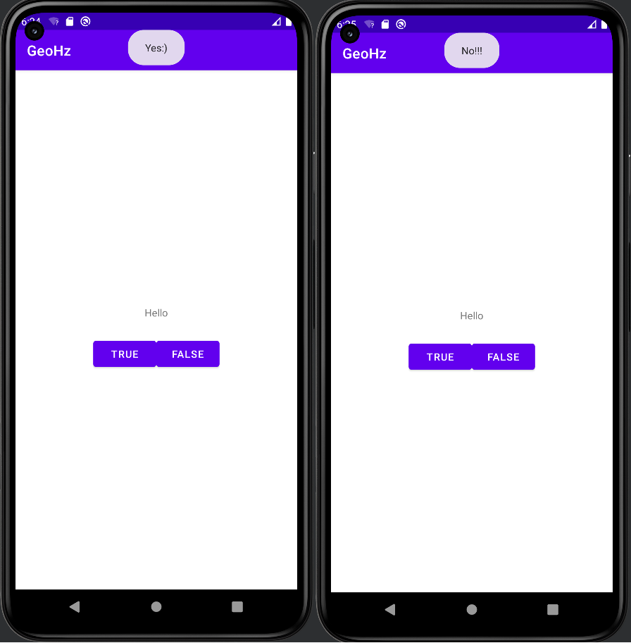

МИНИСТЕРСТВО НАУКИ И ВЫСШЕГО ОБРАЗОВАНИЯ
РОССИЙСКОЙ ФЕДЕРАЦИИ
ФЕДЕРАЛЬНОЕ ГОСУДАРСТВЕННОЕ БЮДЖЕТНОЕ
ОБРАЗОВАТЕЛЬНОЕ УЧРЕЖДЕНИЕ ВЫСШЕГО ОБРАЗОВАНИЯ
«САХАЛИНСКИЙ ГОСУДАРСТВЕННЫЙ УНИВЕРСИТЕТ»

      

 Институт естественных наук и техносферной безопасности   Кафедра информатики   Пашаян Самвел Алексанович 

   

 Лабораторная работа №1   «Первое Android-приложение»  01.03.02 Прикладная математика и информатика

            

 Научный руководитель  
Соболев Евгений Игоревич

   

 г. Южно-Сахалинск   2023г.

***
# 
 ЗАДАНИЕ 

Измените уведомление так, чтобы оно отображалось в верхней, а не в нижней части экрана. Для изменения способа отображения уведомления воспользуйтесь функцией setGravity класса Toast. Выберите режим Gravity.TOP. 
***
# 
 РЕШЕНИЕ 

            true_button.setOnClickListener {
                val toast = Toast.makeText(this,R.string.correct_toast,Toast.LENGTH_SHORT)
                toast.setGravity(Gravity.TOP,0,0)
                toast.show()
            }

            false_button.setOnClickListener {
                val toast = Toast.makeText(this,R.string.incorrect_toast,Toast.LENGTH_SHORT)
                toast.setGravity(Gravity.TOP,0,0)
                toast.show()
            }
## 
 ВЫВОД 
      
Итогом работы стало создание своего первого Android приложения и знакомство с интерфейсом Android Studio. По заданию мы поработали с уведомлением и нужно было его изменить так, чтобы оно отображалось в верхней, а не в нижней части экрана. Это позволяет сделать вывод, что цель данной лабораторной работы успешно достигнута
***  

 